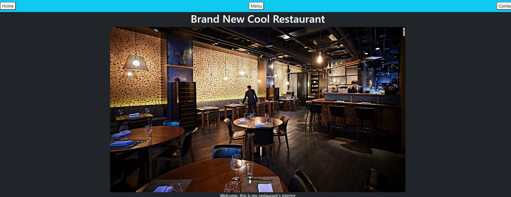

# Restaurant App

It's a Restaurant app to show the restaurant, the menu and to contact the owner information dynamically by clicking in the button in the Nav Bar



- Has the information about the restaurant
- Shows the menu.
- Has a contact section.

## Built With

- Html, CSS, and JavaScript
- Bootstrap

## Live Demo

[Live Demo Link](https://fdi96.github.io/Restaurant-App/)

## Getting Started

To get a local copy up and running follow these simple example steps.

### Install

You can download the code to your personal computer clonig the repository using the following command

```
git clone https://github.com/FdI96/Restaurant-App.git
```

### Usage

To run this project you only need to open the index.html file in a web browser

## Authors

👤 **Federico Ignacio Lopez Cechini**

- Github: [@FdI96](https://github.com/FdI96)
- Twitter: [@federicolopezc7](https://twitter.com/federicolopezc7)
- Linkedin: [Lopez Cechini Federico Ignacio](https://www.linkedin.com/in/federico-ignacio-lopez-cechini-3285411a4/)

## 🤝 Contributing

Contributions, issues, and feature requests are welcome!

Feel free to check the [issues page](https://github.com/FdI96/Restaurant-App/issues).

## Show your support

Give a ⭐️ if you like this project!

## 📝 License

This project is [MIT](./LICENSE) licensed.
